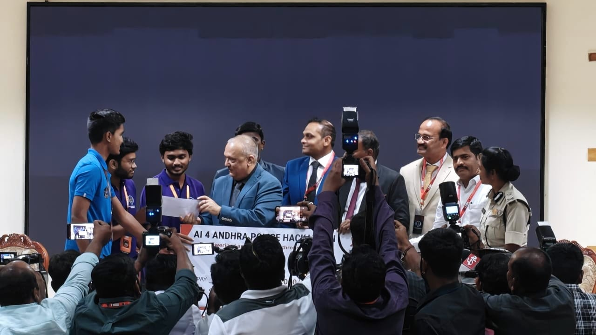
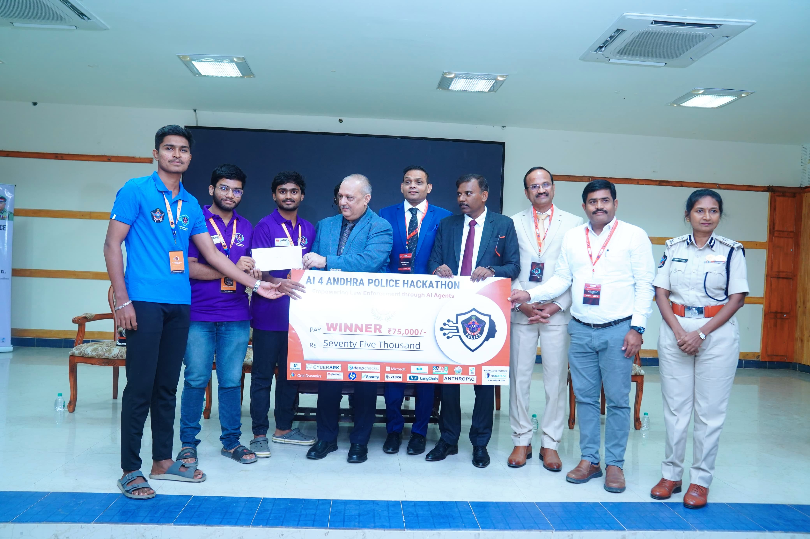
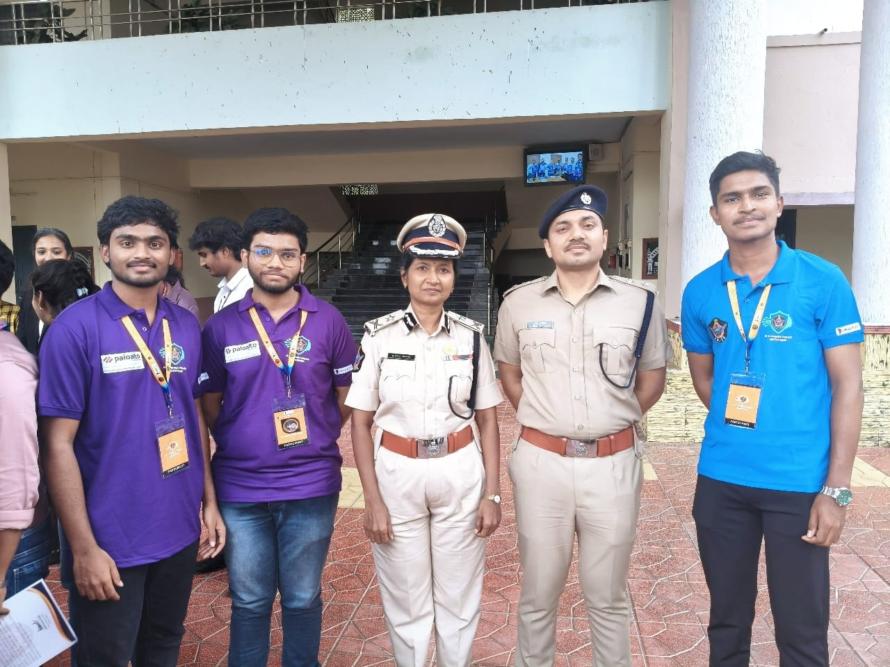
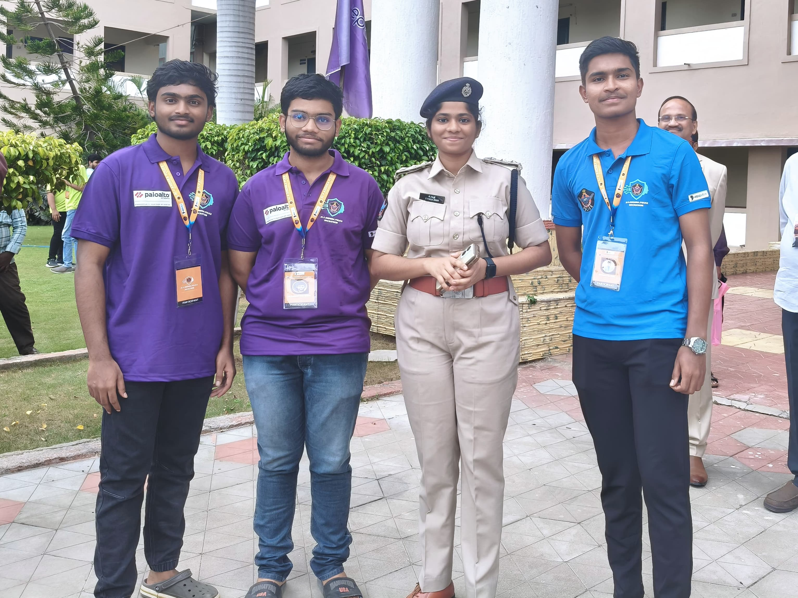
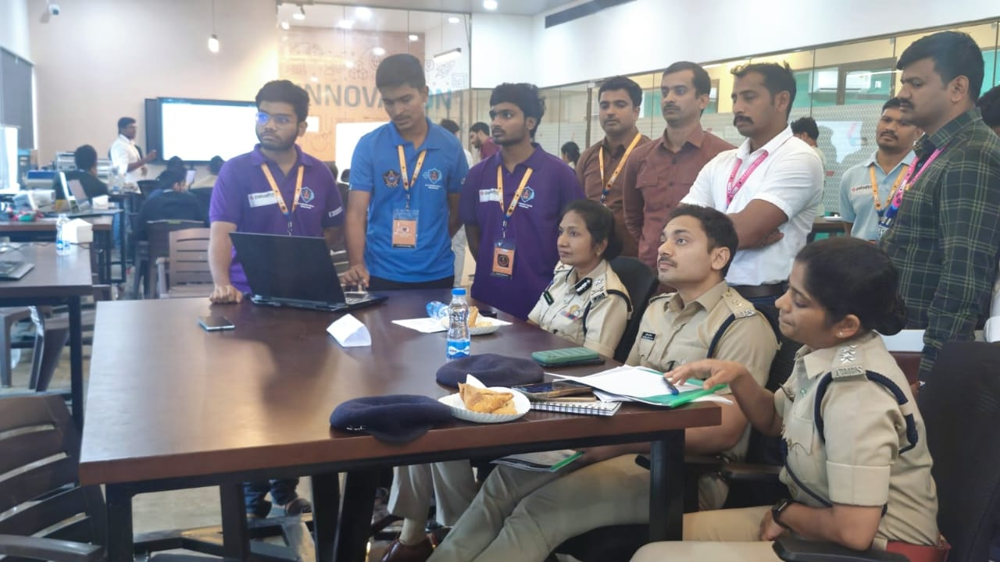
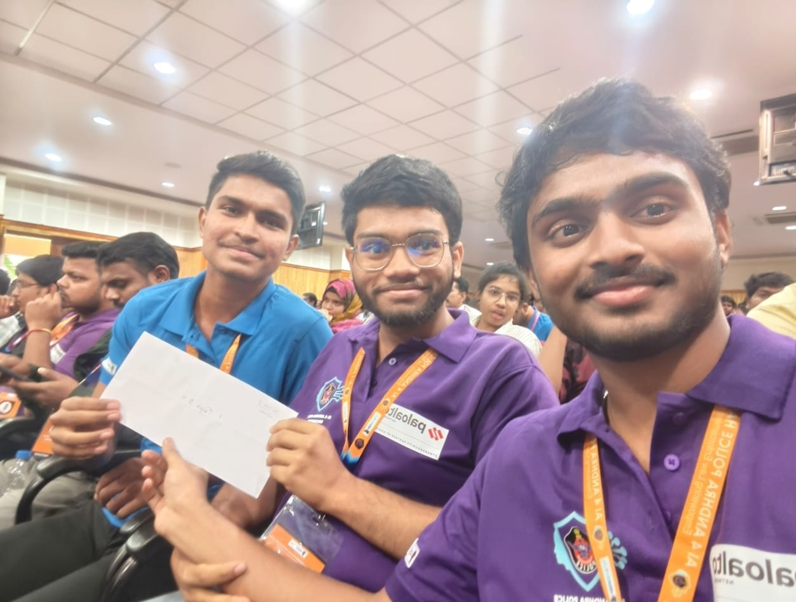
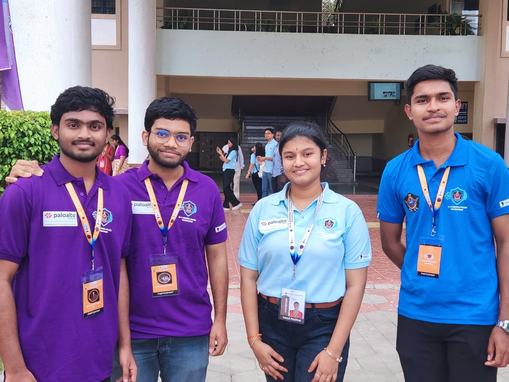

# 🏆 AI-4-AP-Police: Digitization of Official Correspondence

> **Winner** of the Andhra Pradesh Police Digitization Problem Statement


<br>
<div align="center">
  
**Sai Manikanta Eswar Machara<sup>1</sup>, Nikhileswara Rao Sulake<sup>1</sup><sup>,2</sup>, Gopi Jagadeesh Mahamkali<sup>1</sup>**
  
<sup>1</sup>Department of Computer Science and Engineering, RGUKT Nuzvid, India<br>

<sup>2</sup>School of Medical Science and Technology, IIT Kharagpur, Kolkata, India

</div>


|  |  | |
|---------------------------------|---------------------------------|---------------------------------|
|  |  |  |              


A comprehensive AI-powered solution for automating the digitization workflow of official police department correspondence. This system leverages cutting-edge computer vision and natural language processing to classify, extract, validate, and store information from five types of department letters.

## 🎯 Overview

The **AI-4-AP-Police Digitization** project addresses a critical real-world challenge: automatically digitizing various types of official police letters through an intelligent pipeline that:

- **🔍 Classifies** document types with high accuracy
- **📝 Extracts** structured fields from unstructured text and visual elements
- **🏷️ Detects** department stamps and signatures for authenticity verification
- **✅ Validates** extracted data according to department-specific rules
- **💾 Stores** processed information in a structured database for easy retrieval

## ✨ Key Features

### 🤖 AI-Powered Processing
- **Multi-class Document Classification**: Accurately categorizes letters into 5 official types
- **Intelligent Field Extraction**: Retrieves key-value pairs using advanced vision-language models
- **Stamp & Signature Detection**: Uses YOLO-based object detection for authenticity verification
- **Multi-page PDF Support**: Processes complex multi-page documents seamlessly

### 🎨 Modern Web Interface
- **React + TypeScript Frontend**: Intuitive, responsive user interface
- **Real-time Processing**: Live feedback during document analysis
- **Drag & Drop Upload**: Easy file upload with PDF support
- **Advanced Search**: Comprehensive document search and filtering
- **Export Capabilities**: Multiple export formats (CSV, JSON, Excel)

### 🔧 Robust Backend
- **Flask API**: RESTful backend with comprehensive endpoints
- **Database Integration**: SQLite database with full CRUD operations
- **Model Management**: Efficient handling of multiple AI models
- **Error Handling**: Comprehensive error management and logging

## 📋 Document Types Supported

| Document Type | Key Fields Extracted | Use Case |
|---------------|---------------------|----------|
| **Medical Leave** | Name, Date, Company, Rank, Leave Reason, Phone, Unit | Personnel leave applications |
| **Reward Letter** | RC No, HOO No, Date, Issuing Authority, Reward Details | Recognition and commendations |
| **Punishment Letter** | RC No, DO No, Order Date, Punishment Details, Offense Description | Disciplinary actions |
| **Probation Letter** | Service Category, Probationer Name, Period, Tests, Character Assessment | Performance evaluations |
| **Earned Leave** | RC No, HOD No, PC/HC No, Name, Leave Period, Days | Leave sanctioning |


## 🚀 Quick Start

### Prerequisites
- **Python 3.8+** with pip
- **Node.js 16+** with npm
- **Git** for cloning

### Backend Setup

```


# Clone the repository
git clone https://github.com/Nikhil-Rao20/TripleD-AI4AP-Police_Doc2Data.git
cd TripleD-AI4AP-Police_Doc2Data

# Set up Python backend

cd backend
pip install -r requirements.txt

# Set up environment variables

export GEMINI_API_KEY="your_gemini_api_key_here"

# Initialize database

python setup_database.py

# Start the Flask server

python app.py

```

### Frontend Setup

```


# Install frontend dependencies

npm install

# Start the development server

npm run dev

```

The application will be available at:
- **Frontend**: http://localhost:5173
- **Backend API**: http://localhost:5000

## 🔧 Configuration


### Model Configuration
The system uses several AI models:
- **Qwen2.5-VL-3B-Instruct**: Document classification and field extraction
- **Custom YOLO models**: Stamp and signature detection
- **Gemini API**: Field parsing and validation

## 📁 Project Structure

```

AI-4-AP-Police---Digitization/
├── backend/                    \# Python Flask API
│   ├── app.py                 \# Main Flask application
│   ├── database.py            \# Database operations
│   ├── gemini_field_parser.py \# Gemini integration
│   ├── OD_Models/             \# YOLO detection models
│   ├── requirements.txt       \# Python dependencies
│   └── setup_database.py      \# Database initialization
├── src/                       \# React TypeScript frontend
│   ├── components/            \# UI components
│   ├── services/              \# API services
│   ├── types/                 \# TypeScript definitions
│   └── App.tsx               \# Main React component
├── uploads/                   \# Uploaded files storage
├── stamps/                    \# Extracted stamps
├── signatures/                \# Extracted signatures
├── package.json              \# Node.js dependencies
└── README.md                 \# Project documentation

```

## 🔬 Model Performance

| Metric | Score | Details |
|--------|-------|---------|
| **Classification Accuracy** | >95% | Tested on real police documents |
| **Field Extraction Precision** | >90% | High accuracy with minimal manual verification |
| **Stamp Detection Recall** | >85% | Robust across varied stamp types |
| **Processing Speed** | ~2-5s | Per document (depending on complexity) |

## 🌐 API Endpoints

### Document Processing
```

POST /save-image          \# Upload document
POST /classify            \# Classify document type
POST /detect-fields       \# Extract structured fields
POST /detect-stamp        \# Detect and crop stamps
POST /detect-signature    \# Detect and crop signatures

```

### Database Operations
```

GET    /documents         \# Get all documents
POST   /documents         \# Save document
DELETE /documents/:id     \# Delete document
GET    /search           \# Search documents
GET    /statistics       \# Get database stats

```

### Export Functions
```

GET /export/csv          \# Export to CSV
GET /export/json         \# Export to JSON
GET /export/excel        \# Export to Excel

```


## 🏅 Acknowledgments

- **Andhra Pradesh Police Department, India** for providing the problem statement and dataset, and for conducting the hackathon


---

<div align="center">

**⭐ Star this repository if it helped you! ⭐**

*Built with ❤️ for the Andhra Pradesh Police Department*


</div>
